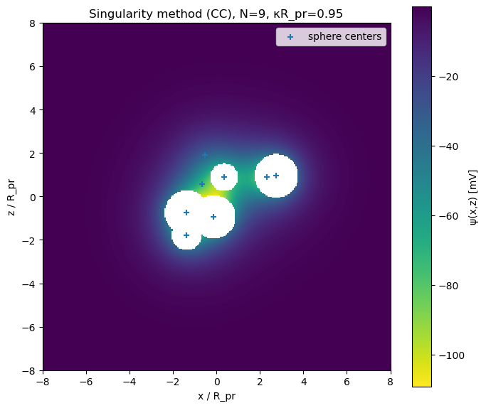
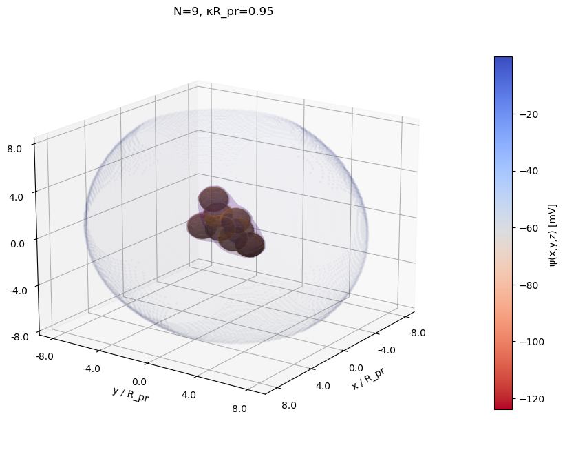

# Singularity-Method-Cluster-Electrostatic-Simulations
A simple kinetic algorithm to create Reaction-Limited-Cluster-Aggregates (RLCA) of charged particles and simulate their electrostatic double-layer utilizing the Singularity Method. Constant potential and constant charge as surface charge regulation models can be used.

  
  

A singularity method models the cluster electrostatic potential as a superposition of screened Coulomb (Yukawa) point singularities placed inside each sphere, with their strengths fitted to satisfy the boundary conditions (constant potential or constant charge) at surface control points. More information: Schießl, K. et al. , M. Calculation of double layer interaction between colloidal aggregates. Adv. Powder Technol. 23, 139–147 (2012).

1. User chooses the charge regulation condition: Constant Potential (CP) or Constant Charge (CC) on the surface of the nanoparticles, sets the a value for the surface charge or potential of the "isolated" particle, a number of particles in the RLCA cluster and the number of control points per singularity.
2. Plots a 2D slice of the electrostatic potential around the cluster
3. Provides a 3D plot of the cluster and the double-layer around.
4. Produces multiple RLCA clusters, calculates their radius of gyration (Rg), the average electrostatic potential on a spherical shell at r=Rg, and the standard deviation on the potential at r=Rg. This can be used to model analytically the electrostatic interactions between clusters using non-uniformly charged sphere models. More information: D.Sapalidis et al. ....
